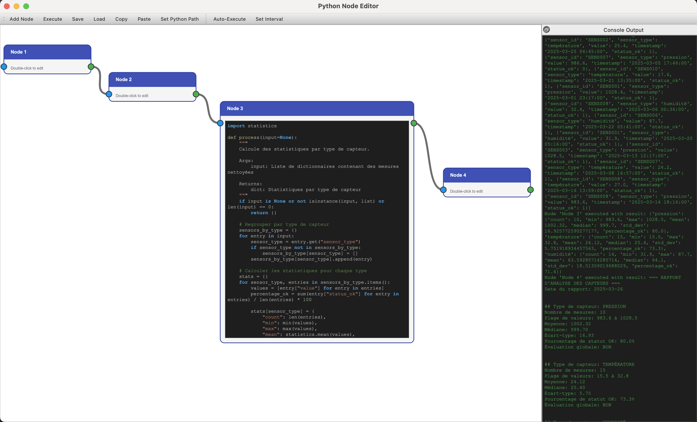

# Python Node Editor

A flexible visual programming environment that lets you create, connect, and execute Python code nodes in an intuitive graphical interface.



## Features

### Visual Programming
- Create nodes that contain Python code
- Connect nodes through input/output ports to create processing flows
- Execute the graph to process data sequentially
- Expand/collapse nodes to edit or view their code

### Advanced Editing
- Copy and paste nodes with Ctrl+C / Ctrl+V (including connections between selected nodes)
- Double-click on node titles to rename them
- Double-click on node bodies to expand them and edit their Python code
- Right-click to delete nodes and connections

### Project Management
- Save and load entire graphs as JSON files
- Merge nodes from JSON files via drag and drop without clearing the canvas
- Automatic execution at configurable intervals

### Python Integration
- Each node contains a Python function called `process()`
- Nodes have access to many built-in Python modules
- Easy integration with data science libraries if installed

## Getting Started

### Prerequisites

- Python 3.6 or higher
- PySide6

### Installation

```bash
# Clone the repository
git clone https://github.com/yourusername/python-node-editor.git
cd python-node-editor

# Install dependencies
pip install PySide6
```

### Running the Application

```bash
python main.py
```

## Usage Guide

### Creating Your First Flow

1. **Add Nodes**: Click "Add Node" in the toolbar to create new nodes
2. **Edit Code**: Double-click a node to expand it and edit its Python code
3. **Connect Nodes**: Drag from an output port (right side) to an input port (left side)
4. **Execute**: Click "Execute" to run the flow

### Writing Node Code

Each node must define a `process()` function that processes input data:

```python
# Example node that doubles its input
def process(input=None):
    if input is None:
        return 0
    return input * 2
```

### Keyboard Shortcuts

- **Ctrl+C**: Copy selected nodes (with their connections)
- **Ctrl+V**: Paste copied nodes
- **Right-click**: Delete nodes or connections

### Auto-Execution

1. Click "Auto-Execute" in the toolbar to enable automated execution
2. Use "Set Interval" to configure the execution frequency (in seconds)

## Project Structure

- `main.py`: Application entry point and main window
- `node.py`: Node item implementation
- `connection.py`: Connection between nodes
- `code_editor.py`: Python code editor with syntax highlighting

## Contributing

Contributions are welcome! Please feel free to submit a Pull Request.

## License

This project is licensed under the MIT License - see the LICENSE file for details.

## Acknowledgments

- Built with PySide6 and Python
- Inspired by node-based programming environments like Blender, Unreal Engine, and Max/MSP
